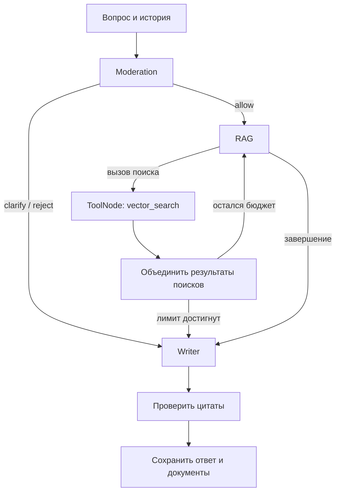

# FAQ chatbot
[Tinkoff Knowledge base](https://www.kaggle.com/datasets/artemgoncarov/dataset)


FastAPI-сервис поиска по базе FAQ: OpenRouter/Ollama → LangGraph → PostgreSQL/pgvector.
Возвращает ответ, цитаты и полные найденные документы. История сохраняется в PostgreSQL.

## Запуск через Docker

```bash
cp .env.example .env
# Заполнить необходимые поля в .env.
docker compose up --build
```

Первый запуск создаёт таблицы, очищает `data_raw/train_our.jsonl`, считает эмбеддинги и запускает API после загрузки. Повторный запуск с неизменёнными данными и настройками
эмбеддинги использует готовый индекс.

Swagger: **http://localhost:8000/docs**

## Локальный запуск
```bash
uv sync
uv run python -m faq_service.application.ingestion.pipeline
uv run uvicorn faq_service.api.main:app --reload
```

## API


```bash
# Создать новый чат и получить chat_id
curl -s -X POST http://localhost:8000/api/v1/chats

# Отправить сообщение в чат
curl -s http://localhost:8000/api/v1/chats/CHAT_ID/messages \
  -H 'Content-Type: application/json' \
  -d '{"message":"Какая комиссия за переводы физлицу?"}'
```

Ответ содержит `status`, `answer`, `citations`, `documents`, `chat_id`, `run_id`.
`documents` — полные документы, фрагменты которых переданы writer; `citations` —
использованные источники с точной цитатой и ID фрагмента.
Статусы: `answered`, `needs_clarification`, `no_answer`, `rejected`.

| Endpoint | Назначение |
|---|---|
| `POST /api/v1/chats` | Новый чат |
| `POST /api/v1/chats/{id}/messages` | Вопрос и ответ |
| `GET /api/v1/documents/{id}` | Документ и происхождение |
| `GET /health/live` | Процесс работает |
| `GET /health/ready` | Индекс готов, embedding-профиль совпадает |

## Архитектура

```text
src/faq_service/
  api/                         # API, схемы, ошибки, роутеры
    routers/                   # чаты, документы, health-check
  application/
    agents/                    # агенты: модерация, RAG, генерация
    models/                    # модели данных и состояния
    workflows/                 # сборка и выполнение workflow
    tools/                     # vector search
    services/                  # история чатов и обработка запросов
    ingestion/                 # загрузка данных из JSONL
    prompts/                   # промпты
  domain/                      # бизнес-сущности, ошибки, валидация
  infrastructure/
    db/                        # БД, схема, подключения, блокировки
      repositories/            # работа с данными корпуса, чатов и документов
    llm/                       # интеграции с LLM
    langfuse/                  # трассировка
  settings/                    # настройки
```


## Схема работы запроса


